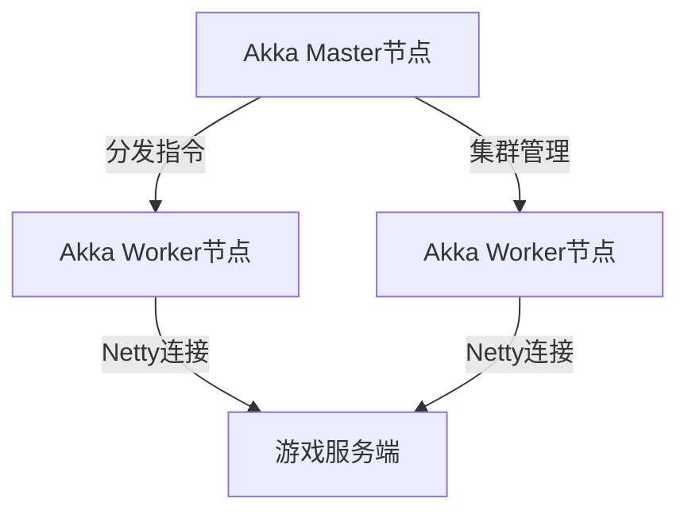

# 大规模游戏客户端TCP压力模拟Demo


基于 **Akka** 与 **Netty** 构建的高性能分布式压力测试工具，专为模拟海量游戏客户端TCP请求设计，适用于MMORPG、实时对战等场景的性能验证。

---

## 项目亮点 ✨
- **万级并发**：通过 Akka Actor 模型实现轻量级客户端模拟，单节点支持 10,000+ 并行连接 [[1]](#__1) [[2]](#__2)
- **协议灵活**：内置 TCP 粘包/半包处理（LengthFieldBasedFrameDecoder）与 JSON/Protobuf 编解码器 [[3]](#__3) [[4]](#__4)
- **动态扩缩容**：Akka 集群支持运行时动态增减模拟节点，适应不同压力阶段 [[5]](#__5)
- **可视化监控**：集成 Prometheus + Grafana 展示 QPS、延迟、错误率等核心指标

---

## 技术栈 �️
| **模块** | **技术选型**                                                                 |
|--------|--------------------------------------------------------------------------|
| 分布式架构  | Akka Cluster（Actor模型）、Sharding分片管理 [[1]](#__1) [[5]](#__5)               |
| 网络层    | Netty 4.x（NIO）、TCP长连接保活、自定义心跳协议（IdleStateHandler）[[4]](#__4) [[6]](#__6) |
| 数据序列化  | Protobuf（高效二进制协议） / JSON（调试友好）[[3]](#__3)                                |
| 部署运维   | Docker Compose、Kubernetes Operator（自动扩缩容）                                |

---

## 架构设计 



### 核心组件
#### 客户端模拟器（Client Simulator）

- Akka Actor 封装虚拟客户端行为（登录、移动、战斗等）
- Netty 实现非阻塞IO，每个Actor绑定独立Channel

#### 服务端负载生成器（Load Generator）
- 基于 Akka Router 动态创建子Actor，支持 RoundRobin/随机策略
- 流量整形模块（Token Bucket 算法）控制请求速率

#### 监控告警系统
- 实时统计连接数、吞吐量、错误类型
- 异常检测（如连续超时）触发自动熔断

## 快速开始
- JDK 11+
- Scala 2.13 / Kotlin 1.6
- 至少 4GB 空闲内存

```bash
# 1. 编译打包
./gradlew shadowJar

# 2. 启动Akka集群种子节点
java -Dconfig.resource=cluster.conf -jar simulator.jar seed

# 3. 加入工作节点
java -Dconfig.resource=worker.conf -jar simulator.jar worker

# 4. 执行压力测试
curl -X POST http://master:8080/load-test -d '{"qps":5000, "duration":"10m"}'

```

### 性能验证建议
- 压力测试：使用Gatling或JMeter模拟万级连接，监控线程数和内存占用。
- 监控指标：通过Akka的MetricsExtension跟踪Actor邮箱大小和消息处理延迟。
- JVM参数调优：增加堆外内存（-XX:MaxDirectMemorySize）以支持Netty的Direct Buffer。

## 扩展性计划
- UDP协议支持（基于Netty DatagramChannel）
- WebSocket模拟客户端接入
- 录屏回放功能（自动生成测试脚本）